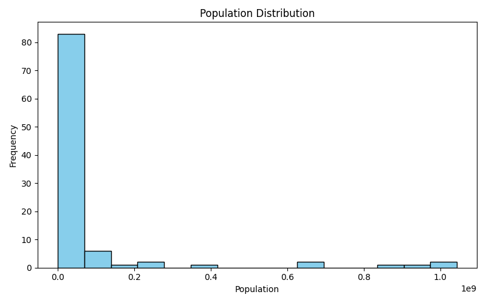
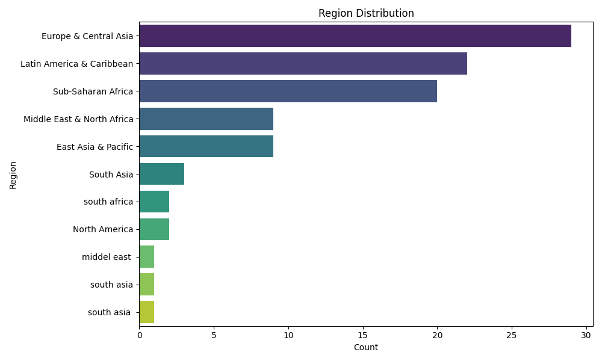

# SCT_DS_1 - Population Distribution Visualization

## Overview

This project focuses on data visualization using Python. The objective is to analyze population-related data and create meaningful visualizations to understand the distribution of continuous and categorical variables.

The project was completed as part of the SkillCraft Technology Data Science Internship (Task 1).

## Tools & Technologies

* Python
* Pandas
* Matplotlib
* Seaborn

## Dataset

The dataset contains demographic and population-related information such as:

* Serial Number
* Country Name
* Age
* Gender
* Region
* Population

## Data Preparation

The following preprocessing steps were performed:

* Loaded the dataset using Pandas.
* Checked dataset structure and column names.
* Removed extra spaces from column names.
* Converted population values to numeric format.
* Handled missing values where necessary.
* Verified data before visualization.

## Data Visualization

The following visualizations were created:

* Population Distribution Histogram
* Gender Distribution Bar Chart
* Region Distribution Bar Chart

## Output Visualizations

### Population Distribution Histogram



### Gender Distribution Bar Chart


### Region Distribution Bar Chart



## Key Insights

* Most population values are concentrated in the lower population range, while a few countries have significantly larger populations.
* The gender distribution provides an overview of male and female representation within the dataset.
* Regional analysis highlights the distribution of records across different geographic regions.
* Data visualization helps identify trends, patterns, and potential outliers in the dataset.

## Project Structure

```text
SCT_DS_1/
│
├── SCT_DS_1.xlsx
├── SCT_DS_1.py
├── README.md
├── population_distribution.png
├── gender_distribution.png
└── region_distribution.png
```

## Conclusion

This project demonstrates the use of Python libraries such as Pandas, Matplotlib, and Seaborn for data visualization. Through histograms and bar charts, the analysis provides insights into population distribution and categorical variables, helping to better understand the dataset.

## Author

**Ch. Akshara**
BVRIT Hyderabad
SkillCraft Technology – Data Science Intern
